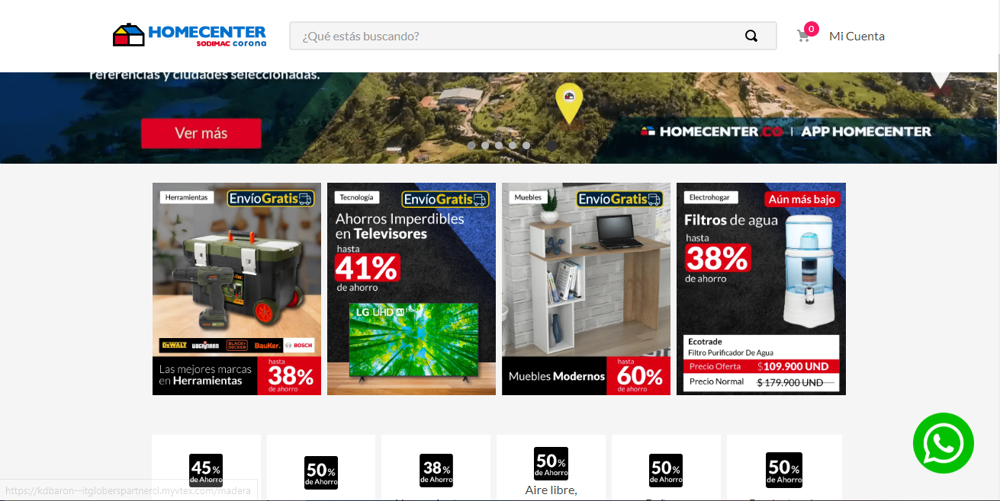

📢 Use this project, [contribute](https://github.com/{OrganizationName}/{AppName}) to it or open issues to help evolve it using [Store Discussion](https://github.com/vtex-apps/store-discussion).

<!-- DOCS-IGNORE:start -->
<!-- ALL-CONTRIBUTORS-BADGE:START - Do not remove or modify this section -->
[](#contributors-)
<!-- ALL-CONTRIBUTORS-BADGE:END -->
<!-- DOCS-IGNORE:end -->

# WhatsApp Button

This component allows you to display a button that takes the user to a help chat in WhatsApp.



## Configuration 

Next I will explain how to have the Whats app Component in the store theme:

1. Import the WhatsApp's app to your theme's dependencies in the `manifest.json`, for example:

```
  dependencies: {
    "itgloberspartnercl.whatsapp-button": "0.x"
  }
```

2. Add the `whatsapp-button` block to the Product template. For example:
```
  "whatsapp-button": {
    "props": {
      "logo": "String",
      "phone": "String",
      "message": "String",
      "width": "Number",
      "height": "Number"
  }
```

| Props Name | Type   | Description                                                   | Default Value                                                                   |
|------------|--------|---------------------------------------------------------------|---------------------------------------------------------------------------------|
| "logo"     | String | Add the image you want to redirect the user.                  | https://www.unipile.com/wp-content/uploads/2022/02/icone-logo-whatsapp-vert.png |
| "phone"    | String | Add the phone number to which the user will communicate       | "123456789"                                                                     |
| "message"  | String | Add the message that the user will see when entering the chat | "Estás comunicándote con VTEX UNIVERSITY, por favor ingresa tu duda."           |
| "width"    | Number | Add the width you want the image to be                        | 80                                                                              |
| "height"   | Number | Add the height you want the image to be                       | 80                                                                              |


## Customization

No CSS Handles are available yet for the app customization.

<!-- DOCS-IGNORE:start -->

## Contributors ✨

Thanks goes to these wonderful people:

<!-- ALL-CONTRIBUTORS-LIST:START - Do not remove or modify this section -->
<!-- prettier-ignore-start -->
<!-- markdownlint-disable -->
<!-- markdownlint-enable -->
<!-- prettier-ignore-end -->
<!-- ALL-CONTRIBUTORS-LIST:END -->

This project follows the [all-contributors](https://github.com/all-contributors/all-contributors) specification. Contributions of any kind are welcome!

<!-- DOCS-IGNORE:end -->

---- 

Check out some documentation models that are already live: 
- [Breadcrumb](https://github.com/vtex-apps/breadcrumb)
- [Image](https://vtex.io/docs/components/general/vtex.store-components/image)
- [Condition Layout](https://vtex.io/docs/components/all/vtex.condition-layout@1.1.6/)
- [Add To Cart Button](https://vtex.io/docs/components/content-blocks/vtex.add-to-cart-button@0.9.0/)
- [Store Form](https://vtex.io/docs/components/all/vtex.store-form@0.3.4/)
